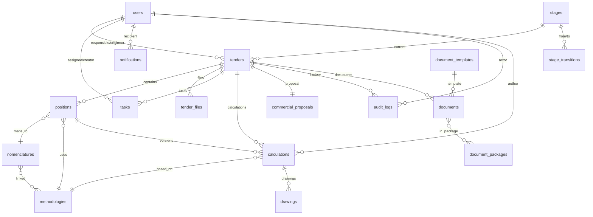

# Модели данных

> **🤖 Для AI-разработчика**: Этот документ — **единый источник истины** для схемы БД.
>
> 1. **SQLAlchemy 2.0**: Используй только новый синтаксис (`Mapped`, `mapped_column`, `select()`).
> 2. **Migrations**: Любое изменение модели требует миграции (`alembic revision --autogenerate`). **Проверяй сгенерированный файл!**
> 3. **Async**: Все запросы только асинхронные (`await db.execute(...)`, `await db.get(...)`).
> 4. **Relationships**: Используй `lazy="selectin"` для коллекций (async friendly) и `lazy="joined"` для `ToOne` связей.

## 📋 Quick Reference

| Компонент       | Технология                      | Примечание                       |
| --------------- | ------------------------------- | -------------------------------- |
| **Database**    | PostgreSQL 16                   | Основное хранилище               |
| **Extensions**  | `pgvector` (0.7+), `pg_trgm`    | Векторный и полнотекстовый поиск |
| **ORM**         | SQLAlchemy 2.0+                 | Async IO, Declarative Base       |
| **Migrations**  | Alembic                         | Версионирование схемы            |
| **Models Path** | `backend/app/modules/*/models/` | Доменное разделение              |

---

## 📁 Файловая структура моделей

```text
backend/app/
├── db/
│   ├── base.py              # Base class для моделей
│   ├── session.py           # AsyncSession factory
│   └── migrations/          # Alembic миграции
├── core/
│   └── models/
│       └── user.py          # User (общая модель)
└── modules/
    ├── tender_management/
    │   └── models/
    │       ├── tender.py    # Tender, TenderFile
    │       ├── stage.py     # Stage, StageTransition
    │       ├── position.py  # Position
    │       ├── task.py      # Task
    │       ├── proposal.py  # CommercialProposal
    │       ├── audit.py     # AuditLog
    │       └── notification.py
    ├── pricing_kb_ai/
    │   └── models/
    │       ├── nomenclature.py  # Nomenclature
    │       ├── methodology.py   # Methodology
    │       ├── calculation.py   # Calculation
    │       └── drawing.py       # Drawing
    └── docflow/
        └── models/
            ├── template.py      # DocumentTemplate
            ├── document.py      # Document
            └── package.py       # DocumentPackage
```

---

## 🏗️ ER-диаграмма



---

## 🔧 Base класс и импорты

```python
# backend/app/db/base.py

from datetime import datetime
from sqlalchemy import MetaData
from sqlalchemy.orm import DeclarativeBase, Mapped, mapped_column
from sqlalchemy.types import DateTime

# Naming convention для constraints (важно для Alembic!)
convention = {
    "ix": "ix_%(column_0_label)s",
    "uq": "uq_%(table_name)s_%(column_0_name)s",
    "ck": "ck_%(table_name)s_%(constraint_name)s",
    "fk": "fk_%(table_name)s_%(column_0_name)s_%(referred_table_name)s",
    "pk": "pk_%(table_name)s"
}

class Base(DeclarativeBase):
    metadata = MetaData(naming_convention=convention)


# Типичные импорты для моделей
from datetime import datetime
from decimal import Decimal
from typing import Optional, List
from sqlalchemy import String, Text, ForeignKey, Boolean, Integer, BigInteger, UniqueConstraint, Index
from sqlalchemy.dialects.postgresql import JSONB
from sqlalchemy.orm import Mapped, mapped_column, relationship
from sqlalchemy.types import Numeric, DateTime
from pgvector.sqlalchemy import Vector

from app.db.base import Base
```

---

## 📊 Таблицы (SQL + SQLAlchemy)

### users

```sql
CREATE TABLE users (
    id SERIAL PRIMARY KEY,
    email VARCHAR(255) UNIQUE NOT NULL,
    password_hash VARCHAR(255) NOT NULL,
    full_name VARCHAR(255) NOT NULL,
    role VARCHAR(50) NOT NULL,  -- admin, manager, engineer, readonly
    is_active BOOLEAN DEFAULT TRUE,
    created_at TIMESTAMP DEFAULT CURRENT_TIMESTAMP,
    updated_at TIMESTAMP DEFAULT CURRENT_TIMESTAMP
);

CREATE INDEX idx_users_email ON users(email);
CREATE INDEX idx_users_role ON users(role);
CREATE INDEX idx_users_active ON users(is_active);
```

```python
# backend/app/core/models/user.py

class User(Base):
    __tablename__ = "users"

    id: Mapped[int] = mapped_column(primary_key=True)
    email: Mapped[str] = mapped_column(String(255), unique=True, nullable=False, index=True)
    password_hash: Mapped[str] = mapped_column(String(255), nullable=False)
    full_name: Mapped[str] = mapped_column(String(255), nullable=False)
    role: Mapped[str] = mapped_column(String(50), nullable=False, index=True)
    is_active: Mapped[bool] = mapped_column(Boolean, default=True, index=True)
    created_at: Mapped[datetime] = mapped_column(DateTime, default=datetime.utcnow)
    updated_at: Mapped[datetime] = mapped_column(DateTime, default=datetime.utcnow, onupdate=datetime.utcnow)
```

**Роли**: `admin`, `manager`, `engineer`, `readonly`

---

### stages

```sql
CREATE TABLE stages (
    id SERIAL PRIMARY KEY,
    code VARCHAR(50) UNIQUE NOT NULL,
    name VARCHAR(100) NOT NULL,
    description TEXT,
    color VARCHAR(20) DEFAULT '#6B7280',
    icon VARCHAR(50),
    "order" INTEGER NOT NULL,
    is_final BOOLEAN DEFAULT FALSE,
    is_active BOOLEAN DEFAULT TRUE,
    auto_actions JSONB,
    created_at TIMESTAMP DEFAULT CURRENT_TIMESTAMP
);

CREATE INDEX idx_stages_code ON stages(code);
CREATE INDEX idx_stages_order ON stages("order");
CREATE INDEX idx_stages_active ON stages(is_active);
```

```python
# backend/app/modules/tender_management/models/stage.py

class Stage(Base):
    __tablename__ = "stages"

    id: Mapped[int] = mapped_column(primary_key=True)
    code: Mapped[str] = mapped_column(String(50), unique=True, nullable=False, index=True)
    name: Mapped[str] = mapped_column(String(100), nullable=False)
    description: Mapped[Optional[str]] = mapped_column(Text)
    color: Mapped[str] = mapped_column(String(20), default="#6B7280")
    icon: Mapped[Optional[str]] = mapped_column(String(50))
    order: Mapped[int] = mapped_column(Integer, nullable=False, index=True)
    is_final: Mapped[bool] = mapped_column(Boolean, default=False)
    is_active: Mapped[bool] = mapped_column(Boolean, default=True, index=True)
    auto_actions: Mapped[Optional[dict]] = mapped_column(JSONB)
    created_at: Mapped[datetime] = mapped_column(DateTime, default=datetime.utcnow)

    # Relationships
    tenders: Mapped[List["Tender"]] = relationship(back_populates="stage", lazy="noload")
    transitions_from: Mapped[List["StageTransition"]] = relationship(
        foreign_keys="StageTransition.from_stage_id", lazy="selectin"
    )
```

**Seed data**:

```sql
INSERT INTO stages (code, name, color, "order", is_final) VALUES
('discovered', 'Обнаружен', '#9CA3AF', 1, false),
('reviewing', 'На рассмотрении', '#3B82F6', 2, false),
('in_progress', 'В работе', '#8B5CF6', 3, false),
('calculating', 'Расчёт стоимости', '#F59E0B', 4, false),
('preparing_docs', 'Подготовка документов', '#10B981', 5, false),
('submitted', 'Подача', '#06B6D4', 6, false),
('awaiting_results', 'Ожидание результатов', '#6366F1', 7, false),
('won', 'Выигран', '#22C55E', 8, true),
('lost', 'Проигран', '#EF4444', 9, true),
('cancelled', 'Отменён', '#6B7280', 10, true);
```

---

### stage_transitions

```sql
CREATE TABLE stage_transitions (
    id SERIAL PRIMARY KEY,
    from_stage_id INTEGER REFERENCES stages(id) NOT NULL,
    to_stage_id INTEGER REFERENCES stages(id) NOT NULL,
    required_role VARCHAR(50),
    requires_all_positions_calculated BOOLEAN DEFAULT FALSE,
    requires_commercial_proposal BOOLEAN DEFAULT FALSE,
    requires_responsible BOOLEAN DEFAULT FALSE,
    requires_engineer BOOLEAN DEFAULT FALSE,
    custom_conditions JSONB,
    auto_create_tasks JSONB,
    send_notification BOOLEAN DEFAULT TRUE,
    notification_template VARCHAR(100),
    is_active BOOLEAN DEFAULT TRUE,
    created_at TIMESTAMP DEFAULT CURRENT_TIMESTAMP,
    UNIQUE(from_stage_id, to_stage_id)
);

CREATE INDEX idx_stage_transitions_from ON stage_transitions(from_stage_id);
CREATE INDEX idx_stage_transitions_to ON stage_transitions(to_stage_id);
```

```python
class StageTransition(Base):
    __tablename__ = "stage_transitions"

    id: Mapped[int] = mapped_column(primary_key=True)
    from_stage_id: Mapped[int] = mapped_column(ForeignKey("stages.id"), nullable=False, index=True)
    to_stage_id: Mapped[int] = mapped_column(ForeignKey("stages.id"), nullable=False, index=True)

    required_role: Mapped[Optional[str]] = mapped_column(String(50))
    requires_all_positions_calculated: Mapped[bool] = mapped_column(Boolean, default=False)
    requires_commercial_proposal: Mapped[bool] = mapped_column(Boolean, default=False)
    requires_responsible: Mapped[bool] = mapped_column(Boolean, default=False)
    requires_engineer: Mapped[bool] = mapped_column(Boolean, default=False)
    custom_conditions: Mapped[Optional[dict]] = mapped_column(JSONB)

    auto_create_tasks: Mapped[Optional[dict]] = mapped_column(JSONB)
    send_notification: Mapped[bool] = mapped_column(Boolean, default=True)
    notification_template: Mapped[Optional[str]] = mapped_column(String(100))

    is_active: Mapped[bool] = mapped_column(Boolean, default=True)
    created_at: Mapped[datetime] = mapped_column(DateTime, default=datetime.utcnow)

    from_stage: Mapped["Stage"] = relationship(foreign_keys=[from_stage_id], lazy="joined")
    to_stage: Mapped["Stage"] = relationship(foreign_keys=[to_stage_id], lazy="joined")

    __table_args__ = (
        UniqueConstraint('from_stage_id', 'to_stage_id', name='uq_stage_transition'),
    )
```

---

### tenders

```sql
CREATE TABLE tenders (
    id SERIAL PRIMARY KEY,
    number VARCHAR(100) UNIQUE NOT NULL,
    title TEXT NOT NULL,
    customer VARCHAR(255) NOT NULL,
    deadline TIMESTAMP NOT NULL,
    date_received TIMESTAMP,
    budget DECIMAL(15, 2),
    stage_id INTEGER REFERENCES stages(id) NOT NULL,
    kanban_order INTEGER DEFAULT 0,
    responsible_id INTEGER REFERENCES users(id),
    engineer_id INTEGER REFERENCES users(id),
    source VARCHAR(100),
    is_archived BOOLEAN DEFAULT FALSE,
    notes TEXT,
    created_at TIMESTAMP DEFAULT CURRENT_TIMESTAMP,
    updated_at TIMESTAMP DEFAULT CURRENT_TIMESTAMP
);

CREATE INDEX idx_tenders_stage ON tenders(stage_id);
CREATE INDEX idx_tenders_responsible ON tenders(responsible_id);
CREATE INDEX idx_tenders_engineer ON tenders(engineer_id);
CREATE INDEX idx_tenders_deadline ON tenders(deadline);
CREATE INDEX idx_tenders_customer ON tenders(customer);
CREATE INDEX idx_tenders_archived ON tenders(is_archived);
CREATE INDEX idx_tenders_kanban ON tenders(stage_id, kanban_order);
CREATE INDEX idx_tenders_number ON tenders(number);
CREATE INDEX idx_tenders_title_fts ON tenders USING gin(to_tsvector('russian', title));
```

```python
# backend/app/modules/tender_management/models/tender.py

class Tender(Base):
    __tablename__ = "tenders"

    id: Mapped[int] = mapped_column(primary_key=True)
    number: Mapped[str] = mapped_column(String(100), unique=True, nullable=False, index=True)
    title: Mapped[str] = mapped_column(Text, nullable=False)
    customer: Mapped[str] = mapped_column(String(255), nullable=False, index=True)
    deadline: Mapped[datetime] = mapped_column(DateTime, nullable=False, index=True)
    date_received: Mapped[Optional[datetime]] = mapped_column(DateTime)
    budget: Mapped[Optional[Decimal]] = mapped_column(Numeric(15, 2))

    stage_id: Mapped[int] = mapped_column(ForeignKey("stages.id"), nullable=False, index=True)
    kanban_order: Mapped[int] = mapped_column(Integer, default=0)

    responsible_id: Mapped[Optional[int]] = mapped_column(ForeignKey("users.id"), index=True)
    engineer_id: Mapped[Optional[int]] = mapped_column(ForeignKey("users.id"), index=True)

    source: Mapped[Optional[str]] = mapped_column(String(100))
    is_archived: Mapped[bool] = mapped_column(Boolean, default=False, index=True)
    notes: Mapped[Optional[str]] = mapped_column(Text)
    created_at: Mapped[datetime] = mapped_column(DateTime, default=datetime.utcnow)
    updated_at: Mapped[datetime] = mapped_column(DateTime, default=datetime.utcnow, onupdate=datetime.utcnow)

    # Relationships
    stage: Mapped["Stage"] = relationship(back_populates="tenders", lazy="joined")
    responsible: Mapped[Optional["User"]] = relationship(foreign_keys=[responsible_id], lazy="joined")
    engineer: Mapped[Optional["User"]] = relationship(foreign_keys=[engineer_id], lazy="joined")
    positions: Mapped[List["Position"]] = relationship(back_populates="tender", cascade="all, delete-orphan", lazy="selectin")
    files: Mapped[List["TenderFile"]] = relationship(back_populates="tender", cascade="all, delete-orphan", lazy="selectin")
    tasks: Mapped[List["Task"]] = relationship(back_populates="tender", cascade="all, delete-orphan", lazy="selectin")
    calculations: Mapped[List["Calculation"]] = relationship(back_populates="tender", lazy="noload")
    commercial_proposal: Mapped[Optional["CommercialProposal"]] = relationship(back_populates="tender", uselist=False, lazy="joined")
    audit_logs: Mapped[List["AuditLog"]] = relationship(back_populates="tender", cascade="all, delete-orphan", lazy="noload")
    documents: Mapped[List["Document"]] = relationship(back_populates="tender", lazy="noload")
```

**Source values**: `eis`, `sberbank_ast`, `roseltorg`, `manual`

---

### tender_files

```sql
CREATE TABLE tender_files (
    id SERIAL PRIMARY KEY,
    tender_id INTEGER REFERENCES tenders(id) ON DELETE CASCADE NOT NULL,
    file_name VARCHAR(255) NOT NULL,
    file_path VARCHAR(500) NOT NULL,
    file_type VARCHAR(50) NOT NULL,
    file_size BIGINT NOT NULL,
    mime_type VARCHAR(100),
    category VARCHAR(50) DEFAULT 'specification',
    ocr_status VARCHAR(50),
    ocr_task_id VARCHAR(100),
    extracted_text TEXT,
    extracted_parameters JSONB,
    description TEXT,
    uploaded_by_id INTEGER REFERENCES users(id) NOT NULL,
    created_at TIMESTAMP DEFAULT CURRENT_TIMESTAMP
);

CREATE INDEX idx_tender_files_tender ON tender_files(tender_id);
CREATE INDEX idx_tender_files_category ON tender_files(category);
CREATE INDEX idx_tender_files_ocr_status ON tender_files(ocr_status);
```

```python
class TenderFile(Base):
    __tablename__ = "tender_files"

    id: Mapped[int] = mapped_column(primary_key=True)
    tender_id: Mapped[int] = mapped_column(ForeignKey("tenders.id", ondelete="CASCADE"), nullable=False, index=True)

    file_name: Mapped[str] = mapped_column(String(255), nullable=False)
    file_path: Mapped[str] = mapped_column(String(500), nullable=False)
    file_type: Mapped[str] = mapped_column(String(50), nullable=False)
    file_size: Mapped[int] = mapped_column(BigInteger, nullable=False)
    mime_type: Mapped[Optional[str]] = mapped_column(String(100))
    category: Mapped[str] = mapped_column(String(50), default="specification", index=True)

    ocr_status: Mapped[Optional[str]] = mapped_column(String(50), index=True)
    ocr_task_id: Mapped[Optional[str]] = mapped_column(String(100))
    extracted_text: Mapped[Optional[str]] = mapped_column(Text)
    extracted_parameters: Mapped[Optional[dict]] = mapped_column(JSONB)

    description: Mapped[Optional[str]] = mapped_column(Text)
    uploaded_by_id: Mapped[int] = mapped_column(ForeignKey("users.id"), nullable=False)
    created_at: Mapped[datetime] = mapped_column(DateTime, default=datetime.utcnow)

    tender: Mapped["Tender"] = relationship(back_populates="files")
    uploaded_by: Mapped["User"] = relationship(lazy="joined")
```

**Category**: `specification`, `commercial`, `correspondence`, `clarification`, `other`
**OCR status**: `pending`, `processing`, `completed`, `failed`

---

### positions

```sql
CREATE TABLE positions (
    id SERIAL PRIMARY KEY,
    tender_id INTEGER REFERENCES tenders(id) ON DELETE CASCADE NOT NULL,
    name VARCHAR(500) NOT NULL,
    description TEXT,
    tender_parameters JSONB,
    quantity DECIMAL(15, 3) NOT NULL,
    unit VARCHAR(50) NOT NULL,

    nomenclature_id INTEGER REFERENCES nomenclatures(id),
    normalized_parameters JSONB,
    original_files JSONB,
    engineer_comment TEXT,

    methodology_id INTEGER REFERENCES methodologies(id),
    current_calculation_id INTEGER REFERENCES calculations(id),

    base_price DECIMAL(15, 2),
    base_price_source VARCHAR(50),
    base_price_date TIMESTAMP,
    base_price_currency VARCHAR(10) DEFAULT 'RUB',
    cost_price DECIMAL(15, 2),
    tender_unit_price DECIMAL(15, 2),
    tender_total_price DECIMAL(15, 2),
    price_formation_logic VARCHAR(50),

    status VARCHAR(50) DEFAULT 'new',
    calculation_status VARCHAR(50) DEFAULT 'not_assigned',

    version INTEGER DEFAULT 1,
    author_id INTEGER REFERENCES users(id),
    last_editor_id INTEGER REFERENCES users(id),
    created_at TIMESTAMP DEFAULT CURRENT_TIMESTAMP,
    updated_at TIMESTAMP DEFAULT CURRENT_TIMESTAMP
);

CREATE INDEX idx_positions_tender ON positions(tender_id);
CREATE INDEX idx_positions_nomenclature ON positions(nomenclature_id);
CREATE INDEX idx_positions_status ON positions(status);
CREATE INDEX idx_positions_calculation_status ON positions(calculation_status);
CREATE INDEX idx_positions_name_fts ON positions USING gin(to_tsvector('russian', name));
```

```python
# backend/app/modules/tender_management/models/position.py

class Position(Base):
    __tablename__ = "positions"

    id: Mapped[int] = mapped_column(primary_key=True)
    tender_id: Mapped[int] = mapped_column(ForeignKey("tenders.id", ondelete="CASCADE"), nullable=False, index=True)

    # Данные из тендера
    name: Mapped[str] = mapped_column(String(500), nullable=False)
    description: Mapped[Optional[str]] = mapped_column(Text)
    tender_parameters: Mapped[Optional[dict]] = mapped_column(JSONB)
    quantity: Mapped[Decimal] = mapped_column(Numeric(15, 3), nullable=False)
    unit: Mapped[str] = mapped_column(String(50), nullable=False)

    # Нормализация
    nomenclature_id: Mapped[Optional[int]] = mapped_column(ForeignKey("nomenclatures.id"), index=True)
    normalized_parameters: Mapped[Optional[dict]] = mapped_column(JSONB)
    original_files: Mapped[Optional[dict]] = mapped_column(JSONB)
    engineer_comment: Mapped[Optional[str]] = mapped_column(Text)

    # Расчёт
    methodology_id: Mapped[Optional[int]] = mapped_column(ForeignKey("methodologies.id"))
    current_calculation_id: Mapped[Optional[int]] = mapped_column(ForeignKey("calculations.id"))

    # Цены
    base_price: Mapped[Optional[Decimal]] = mapped_column(Numeric(15, 2))
    base_price_source: Mapped[Optional[str]] = mapped_column(String(50))
    base_price_date: Mapped[Optional[datetime]] = mapped_column(DateTime)
    base_price_currency: Mapped[str] = mapped_column(String(10), default="RUB")
    cost_price: Mapped[Optional[Decimal]] = mapped_column(Numeric(15, 2))
    tender_unit_price: Mapped[Optional[Decimal]] = mapped_column(Numeric(15, 2))
    tender_total_price: Mapped[Optional[Decimal]] = mapped_column(Numeric(15, 2))
    price_formation_logic: Mapped[Optional[str]] = mapped_column(String(50))

    # Статусы
    status: Mapped[str] = mapped_column(String(50), default="new", index=True)
    calculation_status: Mapped[str] = mapped_column(String(50), default="not_assigned", index=True)

    # Meta
    version: Mapped[int] = mapped_column(Integer, default=1)
    author_id: Mapped[Optional[int]] = mapped_column(ForeignKey("users.id"))
    last_editor_id: Mapped[Optional[int]] = mapped_column(ForeignKey("users.id"))
    created_at: Mapped[datetime] = mapped_column(DateTime, default=datetime.utcnow)
    updated_at: Mapped[datetime] = mapped_column(DateTime, default=datetime.utcnow, onupdate=datetime.utcnow)

    # Relationships
    tender: Mapped["Tender"] = relationship(back_populates="positions")
    nomenclature: Mapped[Optional["Nomenclature"]] = relationship(lazy="joined")
    methodology: Mapped[Optional["Methodology"]] = relationship(lazy="joined")
    current_calculation: Mapped[Optional["Calculation"]] = relationship(foreign_keys=[current_calculation_id], lazy="joined")
    calculations: Mapped[List["Calculation"]] = relationship(back_populates="position", foreign_keys="Calculation.position_id", lazy="selectin")
```

**Status**: `new`, `nomenclature_assigned`, `calculating`, `calculated`, `verified`, `transferred`, `in_proposal`
**Calculation status**: `not_assigned`, `in_progress`, `completed`, `clarification_needed`

---

### nomenclatures

```sql
CREATE TABLE nomenclatures (
    id SERIAL PRIMARY KEY,
    name VARCHAR(255) NOT NULL,
    type VARCHAR(100),
    category VARCHAR(100),
    subclass VARCHAR(100),
    manufacturer VARCHAR(255),
    standard_document VARCHAR(255),
    article VARCHAR(100),

    standard_parameters JSONB NOT NULL,
    required_parameters JSONB,
    optional_parameters JSONB,
    files JSONB,

    base_price DECIMAL(15, 2),
    cost_price DECIMAL(15, 2),
    last_calculation_price DECIMAL(15, 2),
    price_currency VARCHAR(10) DEFAULT 'RUB',
    price_source VARCHAR(50),
    price_updated_at TIMESTAMP,

    synonyms JSONB,
    keywords JSONB,
    tags JSONB,

    usage_count INTEGER DEFAULT 0,
    average_price DECIMAL(15, 2),

    is_active BOOLEAN DEFAULT TRUE,
    version INTEGER DEFAULT 1,
    created_by_id INTEGER REFERENCES users(id),
    last_editor_id INTEGER REFERENCES users(id),
    created_at TIMESTAMP DEFAULT CURRENT_TIMESTAMP,
    updated_at TIMESTAMP DEFAULT CURRENT_TIMESTAMP
);

CREATE INDEX idx_nomenclatures_type ON nomenclatures(type);
CREATE INDEX idx_nomenclatures_category ON nomenclatures(category);
CREATE INDEX idx_nomenclatures_active ON nomenclatures(is_active);
CREATE INDEX idx_nomenclatures_name_fts ON nomenclatures USING gin(to_tsvector('russian', name));
```

```python
# backend/app/modules/pricing_kb_ai/models/nomenclature.py

class Nomenclature(Base):
    __tablename__ = "nomenclatures"

    id: Mapped[int] = mapped_column(primary_key=True)
    name: Mapped[str] = mapped_column(String(255), nullable=False)
    type: Mapped[Optional[str]] = mapped_column(String(100), index=True)
    category: Mapped[Optional[str]] = mapped_column(String(100), index=True)
    subclass: Mapped[Optional[str]] = mapped_column(String(100))
    manufacturer: Mapped[Optional[str]] = mapped_column(String(255))
    standard_document: Mapped[Optional[str]] = mapped_column(String(255))
    article: Mapped[Optional[str]] = mapped_column(String(100))

    standard_parameters: Mapped[dict] = mapped_column(JSONB, nullable=False)
    required_parameters: Mapped[Optional[dict]] = mapped_column(JSONB)
    optional_parameters: Mapped[Optional[dict]] = mapped_column(JSONB)
    files: Mapped[Optional[dict]] = mapped_column(JSONB)

    base_price: Mapped[Optional[Decimal]] = mapped_column(Numeric(15, 2))
    cost_price: Mapped[Optional[Decimal]] = mapped_column(Numeric(15, 2))
    last_calculation_price: Mapped[Optional[Decimal]] = mapped_column(Numeric(15, 2))
    price_currency: Mapped[str] = mapped_column(String(10), default="RUB")
    price_source: Mapped[Optional[str]] = mapped_column(String(50))
    price_updated_at: Mapped[Optional[datetime]] = mapped_column(DateTime)

    synonyms: Mapped[Optional[dict]] = mapped_column(JSONB)
    keywords: Mapped[Optional[dict]] = mapped_column(JSONB)
    tags: Mapped[Optional[dict]] = mapped_column(JSONB)

    usage_count: Mapped[int] = mapped_column(Integer, default=0)
    average_price: Mapped[Optional[Decimal]] = mapped_column(Numeric(15, 2))

    is_active: Mapped[bool] = mapped_column(Boolean, default=True, index=True)
    version: Mapped[int] = mapped_column(Integer, default=1)
    created_by_id: Mapped[Optional[int]] = mapped_column(ForeignKey("users.id"))
    last_editor_id: Mapped[Optional[int]] = mapped_column(ForeignKey("users.id"))
    created_at: Mapped[datetime] = mapped_column(DateTime, default=datetime.utcnow)
    updated_at: Mapped[datetime] = mapped_column(DateTime, default=datetime.utcnow, onupdate=datetime.utcnow)

    # Relationships
    positions: Mapped[List["Position"]] = relationship(back_populates="nomenclature", lazy="noload")
    methodologies: Mapped[List["Methodology"]] = relationship(secondary="nomenclature_methodologies", back_populates="nomenclatures", lazy="selectin")
```

> Планируется расширение модели `Nomenclature`: добавление полей `node_id`, `node_version`, `code`, `lifecycle_status` и связей (`versions`, `synonyms`, `usage`, `methods`). См. раздел `nomenclature_nodes` и соответствующие таблицы ниже.

---

### nomenclature_nodes

> ℹ️ Таблицы этого раздела фиксируют целевую модель справочника (см. `docs/architecture/nomenclature.md`). Они находятся в стадии проектирования и требуют соответствующих миграций/обновления моделей перед внедрением в код.

```sql
CREATE TABLE nomenclature_nodes (
    id BIGSERIAL PRIMARY KEY,
    parent_id BIGINT REFERENCES nomenclature_nodes(id),
    code VARCHAR(32) NOT NULL,
    name VARCHAR(255) NOT NULL,
    node_type VARCHAR(20) NOT NULL, -- segment/family/class/category
    depth SMALLINT NOT NULL,
    version INTEGER NOT NULL DEFAULT 1,
    effective_from TIMESTAMPTZ DEFAULT CURRENT_TIMESTAMP,
    effective_to TIMESTAMPTZ,
    status VARCHAR(20) DEFAULT 'draft',
    is_archived BOOLEAN DEFAULT FALSE,
    metadata JSONB,
    UNIQUE (code, version)
);

CREATE INDEX idx_nomenclature_nodes_parent ON nomenclature_nodes(parent_id);
CREATE INDEX idx_nomenclature_nodes_type ON nomenclature_nodes(node_type);
CREATE INDEX idx_nomenclature_nodes_status ON nomenclature_nodes(status);
```

```python
# backend/app/modules/pricing_kb_ai/models/nomenclature_node.py

class NomenclatureNode(Base):
    __tablename__ = "nomenclature_nodes"

    id: Mapped[int] = mapped_column(primary_key=True)
    parent_id: Mapped[Optional[int]] = mapped_column(ForeignKey("nomenclature_nodes.id"), index=True)
    code: Mapped[str] = mapped_column(String(32), nullable=False)
    name: Mapped[str] = mapped_column(String(255), nullable=False)
    node_type: Mapped[str] = mapped_column(String(20), nullable=False, index=True)
    depth: Mapped[int] = mapped_column(SmallInteger, nullable=False)
    version: Mapped[int] = mapped_column(Integer, default=1)
    effective_from: Mapped[datetime] = mapped_column(DateTime(timezone=True), default=datetime.utcnow)
    effective_to: Mapped[Optional[datetime]] = mapped_column(DateTime(timezone=True))
    status: Mapped[str] = mapped_column(String(20), default="draft", index=True)
    is_archived: Mapped[bool] = mapped_column(Boolean, default=False)
    metadata: Mapped[Optional[dict]] = mapped_column(JSONB)

    parent: Mapped[Optional["NomenclatureNode"]] = relationship(remote_side=[id], back_populates="children")
    children: Mapped[List["NomenclatureNode"]] = relationship(back_populates="parent", lazy="selectin")
    schemas: Mapped[List["NomenclatureClassSchema"]] = relationship(back_populates="node", lazy="selectin")
    # Требует добавления внешнего ключа node_id в таблицу nomenclatures
    cards: Mapped[List["Nomenclature"]] = relationship(back_populates="node", lazy="noload")
```

---

### nomenclature_class_schema

```sql
CREATE TABLE nomenclature_class_schema (
    id BIGSERIAL PRIMARY KEY,
    node_id BIGINT REFERENCES nomenclature_nodes(id) NOT NULL,
    version INTEGER NOT NULL,
    status VARCHAR(20) DEFAULT 'draft',
    json_schema JSONB NOT NULL,
    metadata JSONB,
    published_at TIMESTAMPTZ,
    created_by_id BIGINT REFERENCES users(id),
    created_at TIMESTAMPTZ DEFAULT CURRENT_TIMESTAMP,
    UNIQUE(node_id, version)
);

CREATE INDEX idx_class_schema_node ON nomenclature_class_schema(node_id);
CREATE INDEX idx_class_schema_status ON nomenclature_class_schema(status);
```

```python
# backend/app/modules/pricing_kb_ai/models/nomenclature_schema.py

class NomenclatureClassSchema(Base):
    __tablename__ = "nomenclature_class_schema"

    id: Mapped[int] = mapped_column(primary_key=True)
    node_id: Mapped[int] = mapped_column(ForeignKey("nomenclature_nodes.id"), nullable=False, index=True)
    version: Mapped[int] = mapped_column(Integer, nullable=False)
    status: Mapped[str] = mapped_column(String(20), default="draft", index=True)
    json_schema: Mapped[dict] = mapped_column(JSONB, nullable=False)
    metadata: Mapped[Optional[dict]] = mapped_column(JSONB)
    published_at: Mapped[Optional[datetime]] = mapped_column(DateTime(timezone=True))
    created_by_id: Mapped[Optional[int]] = mapped_column(ForeignKey("users.id"))
    created_at: Mapped[datetime] = mapped_column(DateTime(timezone=True), default=datetime.utcnow)

    node: Mapped["NomenclatureNode"] = relationship(back_populates="schemas", lazy="joined")
    presets: Mapped[List["ClassSchemaPreset"]] = relationship(back_populates="schema", lazy="selectin")
```

---

### nomenclature_attribute_presets

```sql
CREATE TABLE nomenclature_attribute_presets (
    id BIGSERIAL PRIMARY KEY,
    code VARCHAR(50) UNIQUE NOT NULL,
    title VARCHAR(255) NOT NULL,
    json_schema JSONB NOT NULL,
    version INTEGER DEFAULT 1,
    status VARCHAR(20) DEFAULT 'active',
    created_at TIMESTAMPTZ DEFAULT CURRENT_TIMESTAMP
);
```

```python
class NomenclatureAttributePreset(Base):
    __tablename__ = "nomenclature_attribute_presets"

    id: Mapped[int] = mapped_column(primary_key=True)
    code: Mapped[str] = mapped_column(String(50), unique=True, nullable=False)
    title: Mapped[str] = mapped_column(String(255), nullable=False)
    json_schema: Mapped[dict] = mapped_column(JSONB, nullable=False)
    version: Mapped[int] = mapped_column(Integer, default=1)
    status: Mapped[str] = mapped_column(String(20), default="active")
    created_at: Mapped[datetime] = mapped_column(DateTime(timezone=True), default=datetime.utcnow)

    schemas: Mapped[List["ClassSchemaPreset"]] = relationship(back_populates="preset", lazy="noload")
```

---

### class_schema_presets (M2M)

```sql
CREATE TABLE class_schema_presets (
    class_schema_id BIGINT REFERENCES nomenclature_class_schema(id) ON DELETE CASCADE,
    preset_id BIGINT REFERENCES nomenclature_attribute_presets(id) ON DELETE CASCADE,
    mode VARCHAR(10) DEFAULT 'include', -- include/exclude
    PRIMARY KEY (class_schema_id, preset_id)
);
```

```python
class ClassSchemaPreset(Base):
    __tablename__ = "class_schema_presets"

    class_schema_id: Mapped[int] = mapped_column(ForeignKey("nomenclature_class_schema.id"), primary_key=True)
    preset_id: Mapped[int] = mapped_column(ForeignKey("nomenclature_attribute_presets.id"), primary_key=True)
    mode: Mapped[str] = mapped_column(String(10), default="include")

    schema: Mapped["NomenclatureClassSchema"] = relationship(back_populates="presets", lazy="joined")
    preset: Mapped["NomenclatureAttributePreset"] = relationship(back_populates="schemas", lazy="joined")
```

---

### nomenclature_card_versions

```sql
CREATE TABLE nomenclature_card_versions (
    id BIGSERIAL PRIMARY KEY,
    card_id BIGINT REFERENCES nomenclatures(id) ON DELETE CASCADE,
    version INTEGER NOT NULL,
    diff_payload JSONB NOT NULL,
    status VARCHAR(20) DEFAULT 'draft',
    author_id BIGINT REFERENCES users(id),
    comment TEXT,
    created_at TIMESTAMPTZ DEFAULT CURRENT_TIMESTAMP,
    UNIQUE(card_id, version)
);
```

```python
class NomenclatureCardVersion(Base):
    __tablename__ = "nomenclature_card_versions"

    id: Mapped[int] = mapped_column(primary_key=True)
    card_id: Mapped[int] = mapped_column(ForeignKey("nomenclatures.id", ondelete="CASCADE"), nullable=False, index=True)
    version: Mapped[int] = mapped_column(Integer, nullable=False)
    diff_payload: Mapped[dict] = mapped_column(JSONB, nullable=False)
    status: Mapped[str] = mapped_column(String(20), default="draft")
    author_id: Mapped[Optional[int]] = mapped_column(ForeignKey("users.id"))
    comment: Mapped[Optional[str]] = mapped_column(Text)
    created_at: Mapped[datetime] = mapped_column(DateTime(timezone=True), default=datetime.utcnow)

    card: Mapped["Nomenclature"] = relationship(back_populates="versions")
    author: Mapped[Optional["User"]] = relationship(lazy="joined")
```

---

### nomenclature_card_methods

```sql
CREATE TABLE nomenclature_card_methods (
    card_id BIGINT REFERENCES nomenclatures(id) ON DELETE CASCADE,
    methodology_id BIGINT REFERENCES methodologies(id) ON DELETE CASCADE,
    linked_at TIMESTAMPTZ DEFAULT CURRENT_TIMESTAMP,
    PRIMARY KEY (card_id, methodology_id)
);
```

```python
class NomenclatureCardMethod(Base):
    __tablename__ = "nomenclature_card_methods"

    card_id: Mapped[int] = mapped_column(ForeignKey("nomenclatures.id", ondelete="CASCADE"), primary_key=True)
    methodology_id: Mapped[int] = mapped_column(ForeignKey("methodologies.id", ondelete="CASCADE"), primary_key=True)
    linked_at: Mapped[datetime] = mapped_column(DateTime(timezone=True), default=datetime.utcnow)
```

`Nomenclature.methodologies` можно перевести на эту таблицу (расширяет существующую `nomenclature_methodologies`, добавляя timestamp). При миграции нужно сохранить обратную совместимость.

---

### nomenclature_card_synonyms

```sql
CREATE TABLE nomenclature_card_synonyms (
    id BIGSERIAL PRIMARY KEY,
    card_id BIGINT REFERENCES nomenclatures(id) ON DELETE CASCADE,
    value VARCHAR(255) NOT NULL,
    locale VARCHAR(10) DEFAULT 'ru-RU',
    UNIQUE(card_id, value, locale)
);

CREATE INDEX idx_card_synonyms_value ON nomenclature_card_synonyms USING gin (to_tsvector('russian', value));
```

```python
class NomenclatureCardSynonym(Base):
    __tablename__ = "nomenclature_card_synonyms"

    id: Mapped[int] = mapped_column(primary_key=True)
    card_id: Mapped[int] = mapped_column(ForeignKey("nomenclatures.id", ondelete="CASCADE"), nullable=False, index=True)
    value: Mapped[str] = mapped_column(String(255), nullable=False)
    locale: Mapped[str] = mapped_column(String(10), default="ru-RU")

    card: Mapped["Nomenclature"] = relationship(back_populates="synonyms")
```

---

### nomenclature_card_usage

```sql
CREATE TABLE nomenclature_card_usage (
    card_id BIGINT REFERENCES nomenclatures(id) ON DELETE CASCADE,
    position_id BIGINT REFERENCES positions(id) ON DELETE CASCADE,
    usage_count INTEGER DEFAULT 1,
    average_price NUMERIC(15,2),
    last_used_at TIMESTAMPTZ DEFAULT CURRENT_TIMESTAMP,
    PRIMARY KEY (card_id, position_id)
);

CREATE INDEX idx_card_usage_card ON nomenclature_card_usage(card_id);
CREATE INDEX idx_card_usage_position ON nomenclature_card_usage(position_id);
```

```python
class NomenclatureCardUsage(Base):
    __tablename__ = "nomenclature_card_usage"

    card_id: Mapped[int] = mapped_column(ForeignKey("nomenclatures.id", ondelete="CASCADE"), primary_key=True)
    position_id: Mapped[int] = mapped_column(ForeignKey("positions.id", ondelete="CASCADE"), primary_key=True)
    usage_count: Mapped[int] = mapped_column(Integer, default=1)
    average_price: Mapped[Optional[Decimal]] = mapped_column(Numeric(15, 2))
    last_used_at: Mapped[datetime] = mapped_column(DateTime(timezone=True), default=datetime.utcnow)

    card: Mapped["Nomenclature"] = relationship(back_populates="usage")
    position: Mapped["Position"] = relationship(lazy="joined")
```

Используем эту таблицу для аналитики: сколько раз карточка была привязана к позициям, средняя цена и последняя дата использования.

---

### methodologies

```sql
CREATE TABLE methodologies (
    id SERIAL PRIMARY KEY,
    name VARCHAR(255) NOT NULL,
    equipment_type VARCHAR(100) NOT NULL,
    version INTEGER DEFAULT 1,
    formulas JSONB NOT NULL,
    coefficients JSONB NOT NULL,
    required_parameters JSONB NOT NULL,
    optional_parameters JSONB,
    description TEXT,
    is_active BOOLEAN DEFAULT TRUE,
    created_by_id INTEGER REFERENCES users(id),
    created_at TIMESTAMP DEFAULT CURRENT_TIMESTAMP,
    updated_at TIMESTAMP DEFAULT CURRENT_TIMESTAMP
);

CREATE INDEX idx_methodologies_equipment_type ON methodologies(equipment_type);
CREATE INDEX idx_methodologies_active ON methodologies(is_active);
CREATE INDEX idx_methodologies_name_version ON methodologies(name, version);

-- M:N связь
CREATE TABLE nomenclature_methodologies (
    nomenclature_id INTEGER REFERENCES nomenclatures(id) ON DELETE CASCADE,
    methodology_id INTEGER REFERENCES methodologies(id) ON DELETE CASCADE,
    PRIMARY KEY (nomenclature_id, methodology_id)
);
```

```python
# backend/app/modules/pricing_kb_ai/models/methodology.py

class Methodology(Base):
    __tablename__ = "methodologies"

    id: Mapped[int] = mapped_column(primary_key=True)
    name: Mapped[str] = mapped_column(String(255), nullable=False)
    equipment_type: Mapped[str] = mapped_column(String(100), nullable=False, index=True)
    version: Mapped[int] = mapped_column(Integer, default=1)

    formulas: Mapped[dict] = mapped_column(JSONB, nullable=False)
    coefficients: Mapped[dict] = mapped_column(JSONB, nullable=False)
    required_parameters: Mapped[dict] = mapped_column(JSONB, nullable=False)
    optional_parameters: Mapped[Optional[dict]] = mapped_column(JSONB)

    description: Mapped[Optional[str]] = mapped_column(Text)
    is_active: Mapped[bool] = mapped_column(Boolean, default=True, index=True)
    created_by_id: Mapped[Optional[int]] = mapped_column(ForeignKey("users.id"))
    created_at: Mapped[datetime] = mapped_column(DateTime, default=datetime.utcnow)
    updated_at: Mapped[datetime] = mapped_column(DateTime, default=datetime.utcnow, onupdate=datetime.utcnow)

    # Relationships
    nomenclatures: Mapped[List["Nomenclature"]] = relationship(secondary="nomenclature_methodologies", back_populates="methodologies", lazy="noload")
    calculations: Mapped[List["Calculation"]] = relationship(back_populates="methodology", lazy="noload")

    __table_args__ = (
        Index('idx_methodologies_name_version', 'name', 'version'),
    )
```

---

### calculations

```sql
CREATE TABLE calculations (
    id SERIAL PRIMARY KEY,
    title VARCHAR(255) NOT NULL,
    equipment_type VARCHAR(100) NOT NULL,
    methodology_id INTEGER REFERENCES methodologies(id),
    methodology_version INTEGER,

    parameters JSONB NOT NULL,
    used_parameter_values JSONB,
    formulas JSONB,
    coefficients JSONB,
    materials JSONB NOT NULL,
    labor_costs JSONB NOT NULL,
    overhead DECIMAL(5, 4) NOT NULL,
    margin DECIMAL(5, 4) NOT NULL,
    total_cost DECIMAL(15, 2) NOT NULL,

    position_id INTEGER REFERENCES positions(id),
    tender_id INTEGER REFERENCES tenders(id),
    nomenclature_id INTEGER REFERENCES nomenclatures(id),
    author_id INTEGER REFERENCES users(id) NOT NULL,

    embedding vector(3072),
    version INTEGER DEFAULT 1,
    status VARCHAR(50) DEFAULT 'draft',
    created_at TIMESTAMP DEFAULT CURRENT_TIMESTAMP,
    updated_at TIMESTAMP DEFAULT CURRENT_TIMESTAMP
);

CREATE INDEX idx_calculations_tender ON calculations(tender_id);
CREATE INDEX idx_calculations_position ON calculations(position_id);
CREATE INDEX idx_calculations_methodology ON calculations(methodology_id);
CREATE INDEX idx_calculations_author ON calculations(author_id);
CREATE INDEX idx_calculations_equipment_type ON calculations(equipment_type);
CREATE INDEX idx_calculations_status ON calculations(status);
CREATE INDEX idx_calculations_embedding ON calculations USING ivfflat (embedding vector_cosine_ops) WITH (lists = 100);
```

```python
# backend/app/modules/pricing_kb_ai/models/calculation.py

from pgvector.sqlalchemy import Vector

class Calculation(Base):
    __tablename__ = "calculations"

    id: Mapped[int] = mapped_column(primary_key=True)
    title: Mapped[str] = mapped_column(String(255), nullable=False)
    equipment_type: Mapped[str] = mapped_column(String(100), nullable=False, index=True)
    methodology_id: Mapped[Optional[int]] = mapped_column(ForeignKey("methodologies.id"), index=True)
    methodology_version: Mapped[Optional[int]] = mapped_column(Integer)

    parameters: Mapped[dict] = mapped_column(JSONB, nullable=False)
    used_parameter_values: Mapped[Optional[dict]] = mapped_column(JSONB)
    formulas: Mapped[Optional[dict]] = mapped_column(JSONB)
    coefficients: Mapped[Optional[dict]] = mapped_column(JSONB)
    materials: Mapped[dict] = mapped_column(JSONB, nullable=False)
    labor_costs: Mapped[dict] = mapped_column(JSONB, nullable=False)
    overhead: Mapped[Decimal] = mapped_column(Numeric(5, 4), nullable=False)
    margin: Mapped[Decimal] = mapped_column(Numeric(5, 4), nullable=False)
    total_cost: Mapped[Decimal] = mapped_column(Numeric(15, 2), nullable=False)

    position_id: Mapped[Optional[int]] = mapped_column(ForeignKey("positions.id"), index=True)
    tender_id: Mapped[Optional[int]] = mapped_column(ForeignKey("tenders.id"), index=True)
    nomenclature_id: Mapped[Optional[int]] = mapped_column(ForeignKey("nomenclatures.id"))
    author_id: Mapped[int] = mapped_column(ForeignKey("users.id"), nullable=False, index=True)

    embedding: Mapped[Optional[list]] = mapped_column(Vector(3072))
    version: Mapped[int] = mapped_column(Integer, default=1)
    status: Mapped[str] = mapped_column(String(50), default="draft", index=True)
    created_at: Mapped[datetime] = mapped_column(DateTime, default=datetime.utcnow)
    updated_at: Mapped[datetime] = mapped_column(DateTime, default=datetime.utcnow, onupdate=datetime.utcnow)

    # Relationships
    tender: Mapped[Optional["Tender"]] = relationship(back_populates="calculations")
    position: Mapped[Optional["Position"]] = relationship(back_populates="calculations", foreign_keys=[position_id])
    methodology: Mapped[Optional["Methodology"]] = relationship(back_populates="calculations", lazy="joined")
    author: Mapped["User"] = relationship(lazy="joined")
    drawings: Mapped[List["Drawing"]] = relationship(back_populates="calculation", cascade="all, delete-orphan", lazy="selectin")
```

**Status**: `draft`, `approved`, `used`

---

### tasks

```sql
CREATE TABLE tasks (
    id SERIAL PRIMARY KEY,
    tender_id INTEGER REFERENCES tenders(id) ON DELETE CASCADE,
    title VARCHAR(255) NOT NULL,
    description TEXT,
    task_type VARCHAR(50) DEFAULT 'other',
    assignee_id INTEGER REFERENCES users(id),
    creator_id INTEGER REFERENCES users(id) NOT NULL,
    status VARCHAR(50) DEFAULT 'pending',
    priority VARCHAR(50) DEFAULT 'medium',
    due_date TIMESTAMP,
    completed_at TIMESTAMP,
    checklist JSONB,
    created_at TIMESTAMP DEFAULT CURRENT_TIMESTAMP,
    updated_at TIMESTAMP DEFAULT CURRENT_TIMESTAMP
);

CREATE INDEX idx_tasks_tender ON tasks(tender_id);
CREATE INDEX idx_tasks_assignee ON tasks(assignee_id);
CREATE INDEX idx_tasks_status ON tasks(status);
CREATE INDEX idx_tasks_due_date ON tasks(due_date);
CREATE INDEX idx_tasks_type ON tasks(task_type);
```

```python
# backend/app/modules/tender_management/models/task.py

class Task(Base):
    __tablename__ = "tasks"

    id: Mapped[int] = mapped_column(primary_key=True)
    tender_id: Mapped[int] = mapped_column(ForeignKey("tenders.id", ondelete="CASCADE"), nullable=False, index=True)

    title: Mapped[str] = mapped_column(String(255), nullable=False)
    description: Mapped[Optional[str]] = mapped_column(Text)
    task_type: Mapped[str] = mapped_column(String(50), default="other", index=True)

    assignee_id: Mapped[Optional[int]] = mapped_column(ForeignKey("users.id"), index=True)
    creator_id: Mapped[int] = mapped_column(ForeignKey("users.id"), nullable=False)

    status: Mapped[str] = mapped_column(String(50), default="pending", index=True)
    priority: Mapped[str] = mapped_column(String(50), default="medium")

    due_date: Mapped[Optional[datetime]] = mapped_column(DateTime, index=True)
    completed_at: Mapped[Optional[datetime]] = mapped_column(DateTime)
    checklist: Mapped[Optional[dict]] = mapped_column(JSONB)

    created_at: Mapped[datetime] = mapped_column(DateTime, default=datetime.utcnow)
    updated_at: Mapped[datetime] = mapped_column(DateTime, default=datetime.utcnow, onupdate=datetime.utcnow)

    tender: Mapped["Tender"] = relationship(back_populates="tasks")
    assignee: Mapped[Optional["User"]] = relationship(foreign_keys=[assignee_id], lazy="joined")
    creator: Mapped["User"] = relationship(foreign_keys=[creator_id], lazy="joined")
```

**Task type**: `technical`, `documentary`, `administrative`, `other`
**Status**: `pending`, `in_progress`, `completed`, `cancelled`
**Priority**: `low`, `medium`, `high`, `critical`

---

### notifications

```sql
CREATE TABLE notifications (
    id SERIAL PRIMARY KEY,
    recipient_id INTEGER REFERENCES users(id) NOT NULL,
    notification_type VARCHAR(50) NOT NULL,
    title VARCHAR(255) NOT NULL,
    message TEXT NOT NULL,
    tender_id INTEGER REFERENCES tenders(id) ON DELETE SET NULL,
    task_id INTEGER REFERENCES tasks(id) ON DELETE SET NULL,
    is_read BOOLEAN DEFAULT FALSE,
    read_at TIMESTAMP,
    priority VARCHAR(20) DEFAULT 'normal',
    created_at TIMESTAMP DEFAULT CURRENT_TIMESTAMP,
    expires_at TIMESTAMP
);

CREATE INDEX idx_notifications_recipient ON notifications(recipient_id);
CREATE INDEX idx_notifications_type ON notifications(notification_type);
CREATE INDEX idx_notifications_read ON notifications(is_read);
CREATE INDEX idx_notifications_tender ON notifications(tender_id);
CREATE INDEX idx_notifications_created ON notifications(created_at);
CREATE INDEX idx_notifications_recipient_unread ON notifications(recipient_id, is_read) WHERE is_read = FALSE;
```

```python
# backend/app/modules/tender_management/models/notification.py

class Notification(Base):
    __tablename__ = "notifications"

    id: Mapped[int] = mapped_column(primary_key=True)
    recipient_id: Mapped[int] = mapped_column(ForeignKey("users.id"), nullable=False, index=True)

    notification_type: Mapped[str] = mapped_column(String(50), nullable=False, index=True)
    title: Mapped[str] = mapped_column(String(255), nullable=False)
    message: Mapped[str] = mapped_column(Text, nullable=False)

    tender_id: Mapped[Optional[int]] = mapped_column(ForeignKey("tenders.id", ondelete="SET NULL"), index=True)
    task_id: Mapped[Optional[int]] = mapped_column(ForeignKey("tasks.id", ondelete="SET NULL"))

    is_read: Mapped[bool] = mapped_column(Boolean, default=False, index=True)
    read_at: Mapped[Optional[datetime]] = mapped_column(DateTime)
    priority: Mapped[str] = mapped_column(String(20), default="normal")

    created_at: Mapped[datetime] = mapped_column(DateTime, default=datetime.utcnow, index=True)
    expires_at: Mapped[Optional[datetime]] = mapped_column(DateTime)

    recipient: Mapped["User"] = relationship(lazy="joined")
    tender: Mapped[Optional["Tender"]] = relationship(lazy="joined")
    task: Mapped[Optional["Task"]] = relationship(lazy="joined")
```

**Notification type**: `deadline_7_days`, `deadline_3_days`, `deadline_1_day`, `deadline_hours`, `assigned_responsible`, `assigned_engineer`, `stage_changed`, `new_task`, `task_overdue`, `tender_won`, `tender_lost`
**Priority**: `low`, `normal`, `high`, `critical`

---

### audit_logs

```sql
CREATE TABLE audit_logs (
    id SERIAL PRIMARY KEY,
    tender_id INTEGER REFERENCES tenders(id) ON DELETE CASCADE NOT NULL,
    action VARCHAR(100) NOT NULL,
    entity_type VARCHAR(50),
    entity_id INTEGER,
    old_value JSONB,
    new_value JSONB,
    description TEXT,
    actor_id INTEGER REFERENCES users(id) NOT NULL,
    actor_ip VARCHAR(45),
    created_at TIMESTAMP DEFAULT CURRENT_TIMESTAMP
);

CREATE INDEX idx_audit_logs_tender ON audit_logs(tender_id);
CREATE INDEX idx_audit_logs_action ON audit_logs(action);
CREATE INDEX idx_audit_logs_actor ON audit_logs(actor_id);
CREATE INDEX idx_audit_logs_created ON audit_logs(created_at);
CREATE INDEX idx_audit_logs_entity ON audit_logs(entity_type, entity_id);
```

```python
# backend/app/modules/tender_management/models/audit.py

class AuditLog(Base):
    __tablename__ = "audit_logs"

    id: Mapped[int] = mapped_column(primary_key=True)
    tender_id: Mapped[int] = mapped_column(ForeignKey("tenders.id", ondelete="CASCADE"), nullable=False, index=True)

    action: Mapped[str] = mapped_column(String(100), nullable=False, index=True)
    entity_type: Mapped[Optional[str]] = mapped_column(String(50))
    entity_id: Mapped[Optional[int]] = mapped_column(Integer)

    old_value: Mapped[Optional[dict]] = mapped_column(JSONB)
    new_value: Mapped[Optional[dict]] = mapped_column(JSONB)
    description: Mapped[Optional[str]] = mapped_column(Text)

    actor_id: Mapped[int] = mapped_column(ForeignKey("users.id"), nullable=False, index=True)
    actor_ip: Mapped[Optional[str]] = mapped_column(String(45))
    created_at: Mapped[datetime] = mapped_column(DateTime, default=datetime.utcnow, index=True)

    tender: Mapped["Tender"] = relationship(back_populates="audit_logs")
    actor: Mapped["User"] = relationship(lazy="joined")

    __table_args__ = (
        Index('idx_audit_logs_entity', 'entity_type', 'entity_id'),
    )
```

**Action**: `created`, `updated`, `stage_changed`, `responsible_assigned`, `engineer_assigned`, `position_added`, `position_updated`, `position_deleted`, `file_uploaded`, `file_deleted`, `task_created`, `task_completed`, `calculation_created`, `proposal_generated`
**Entity type**: `tender`, `position`, `task`, `file`, `calculation`, `proposal`

---

### commercial_proposals

```sql
CREATE TABLE commercial_proposals (
    id SERIAL PRIMARY KEY,
    tender_id INTEGER REFERENCES tenders(id) ON DELETE CASCADE NOT NULL UNIQUE,
    positions_data JSONB NOT NULL,
    subtotal DECIMAL(15, 2) NOT NULL,
    discount_percent DECIMAL(5, 2),
    discount_amount DECIMAL(15, 2),
    total DECIMAL(15, 2) NOT NULL,
    currency VARCHAR(10) DEFAULT 'RUB',
    file_path VARCHAR(500),
    version INTEGER DEFAULT 1,
    is_draft BOOLEAN DEFAULT TRUE,
    is_sent BOOLEAN DEFAULT FALSE,
    sent_at TIMESTAMP,
    created_at TIMESTAMP DEFAULT CURRENT_TIMESTAMP,
    updated_at TIMESTAMP DEFAULT CURRENT_TIMESTAMP
);

CREATE INDEX idx_commercial_proposals_tender ON commercial_proposals(tender_id);
CREATE INDEX idx_commercial_proposals_draft ON commercial_proposals(is_draft);
```

```python
# backend/app/modules/tender_management/models/proposal.py

class CommercialProposal(Base):
    __tablename__ = "commercial_proposals"

    id: Mapped[int] = mapped_column(primary_key=True)
    tender_id: Mapped[int] = mapped_column(ForeignKey("tenders.id", ondelete="CASCADE"), nullable=False, unique=True, index=True)

    positions_data: Mapped[dict] = mapped_column(JSONB, nullable=False)
    subtotal: Mapped[Decimal] = mapped_column(Numeric(15, 2), nullable=False)
    discount_percent: Mapped[Optional[Decimal]] = mapped_column(Numeric(5, 2))
    discount_amount: Mapped[Optional[Decimal]] = mapped_column(Numeric(15, 2))
    total: Mapped[Decimal] = mapped_column(Numeric(15, 2), nullable=False)
    currency: Mapped[str] = mapped_column(String(10), default="RUB")

    file_path: Mapped[Optional[str]] = mapped_column(String(500))
    version: Mapped[int] = mapped_column(Integer, default=1)
    is_draft: Mapped[bool] = mapped_column(Boolean, default=True, index=True)
    is_sent: Mapped[bool] = mapped_column(Boolean, default=False)
    sent_at: Mapped[Optional[datetime]] = mapped_column(DateTime)

    created_at: Mapped[datetime] = mapped_column(DateTime, default=datetime.utcnow)
    updated_at: Mapped[datetime] = mapped_column(DateTime, default=datetime.utcnow, onupdate=datetime.utcnow)

    tender: Mapped["Tender"] = relationship(back_populates="commercial_proposal")
```

**positions_data structure**: `[{position_id, name, quantity, unit, unit_price, total, discount, comment}]`

---

### drawings, documents, document_templates, document_packages

```sql
-- drawings (чертежи к расчётам)
CREATE TABLE drawings (
    id SERIAL PRIMARY KEY,
    calculation_id INTEGER REFERENCES calculations(id) ON DELETE CASCADE,
    file_path VARCHAR(500) NOT NULL,
    file_type VARCHAR(50) NOT NULL,
    file_size BIGINT NOT NULL,
    extracted_parameters JSONB,
    ocr_status VARCHAR(50) DEFAULT 'pending',
    ocr_task_id VARCHAR(100),
    created_at TIMESTAMP DEFAULT CURRENT_TIMESTAMP
);

-- document_templates (шаблоны документов)
CREATE TABLE document_templates (
    id SERIAL PRIMARY KEY,
    name VARCHAR(255) NOT NULL,
    type VARCHAR(100) NOT NULL,
    customer VARCHAR(255),
    file_path VARCHAR(500) NOT NULL,
    file_type VARCHAR(50) NOT NULL,
    fields JSONB NOT NULL,
    version INTEGER DEFAULT 1,
    is_active BOOLEAN DEFAULT TRUE,
    created_at TIMESTAMP DEFAULT CURRENT_TIMESTAMP,
    updated_at TIMESTAMP DEFAULT CURRENT_TIMESTAMP
);

-- documents (сгенерированные документы)
CREATE TABLE documents (
    id SERIAL PRIMARY KEY,
    template_id INTEGER REFERENCES document_templates(id),
    tender_id INTEGER REFERENCES tenders(id) ON DELETE CASCADE,
    calculation_id INTEGER REFERENCES calculations(id),
    type VARCHAR(100) NOT NULL,
    file_path VARCHAR(500) NOT NULL,
    version INTEGER DEFAULT 1,
    signed BOOLEAN DEFAULT FALSE,
    signature_path VARCHAR(500),
    created_at TIMESTAMP DEFAULT CURRENT_TIMESTAMP,
    updated_at TIMESTAMP DEFAULT CURRENT_TIMESTAMP
);

-- document_packages (пакеты документов)
CREATE TABLE document_packages (
    id SERIAL PRIMARY KEY,
    tender_id INTEGER REFERENCES tenders(id) ON DELETE CASCADE,
    documents JSONB NOT NULL,
    zip_path VARCHAR(500),
    status VARCHAR(50) DEFAULT 'preparing',
    created_at TIMESTAMP DEFAULT CURRENT_TIMESTAMP,
    updated_at TIMESTAMP DEFAULT CURRENT_TIMESTAMP
);
```

---

## 🚀 Миграции (Alembic)

```bash
# Создание миграции
alembic revision --autogenerate -m "описание изменений"

# Применение
alembic upgrade head

# Откат на 1 шаг
alembic downgrade -1

# Откат до конкретной версии
alembic downgrade <revision_id>

# Просмотр истории
alembic history
```

**Путь миграций**: `backend/app/db/migrations/versions/`

---

## 🔍 Индексы для производительности

### Частичные индексы

```sql
-- Непрочитанные уведомления
CREATE INDEX idx_notifications_recipient_unread
ON notifications(recipient_id, is_read) WHERE is_read = FALSE;

-- Активные тендеры
CREATE INDEX idx_tenders_active
ON tenders(stage_id, deadline) WHERE is_archived = FALSE;
```

### Полнотекстовый поиск

```sql
CREATE INDEX idx_tenders_title_fts ON tenders USING gin(to_tsvector('russian', title));
CREATE INDEX idx_positions_name_fts ON positions USING gin(to_tsvector('russian', name));
CREATE INDEX idx_nomenclatures_name_fts ON nomenclatures USING gin(to_tsvector('russian', name));
```

### Векторный поиск (pgvector)

```sql
CREATE INDEX idx_calculations_embedding
ON calculations USING ivfflat (embedding vector_cosine_ops) WITH (lists = 100);
```

---

## 🚫 Запрещено

```python
# ❌ Синхронные запросы
def get_tender(id):
    return db.query(Tender).get(id)

# ✅ Асинхронные запросы
async def get_tender(db: AsyncSession, id: int) -> Tender:
    return await db.get(Tender, id)

# ❌ N+1 запросы
for tender in tenders:
    positions = tender.positions  # Каждый раз SELECT

# ✅ Eager loading
stmt = select(Tender).options(selectinload(Tender.positions))

# ❌ Mapped без Optional для nullable
author_id: Mapped[int] = mapped_column(ForeignKey("users.id"))  # может быть NULL!

# ✅ Optional для nullable полей
author_id: Mapped[Optional[int]] = mapped_column(ForeignKey("users.id"))

# ❌ lazy="joined" для больших коллекций
positions: Mapped[List["Position"]] = relationship(lazy="joined")  # Много позиций!

# ✅ selectin для коллекций
positions: Mapped[List["Position"]] = relationship(lazy="selectin")
```

---

## 📎 Связанные документы

| Документ            | Путь                                       |
| ------------------- | ------------------------------------------ |
| Tender Management   | `docs/modules/tender_management.md`        |
| Pricing KB AI       | `docs/modules/pricing_kb_ai.md`            |
| DocFlow             | `docs/modules/docflow.md`                  |
| System Architecture | `docs/architecture/system_architecture.md` |
