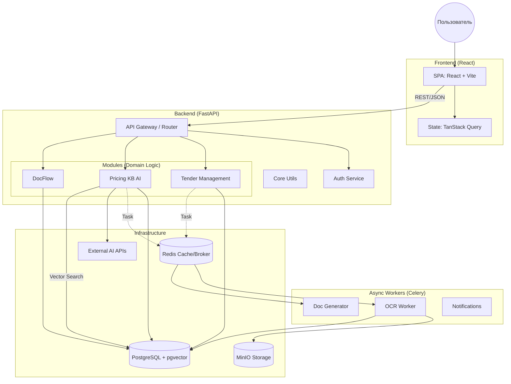
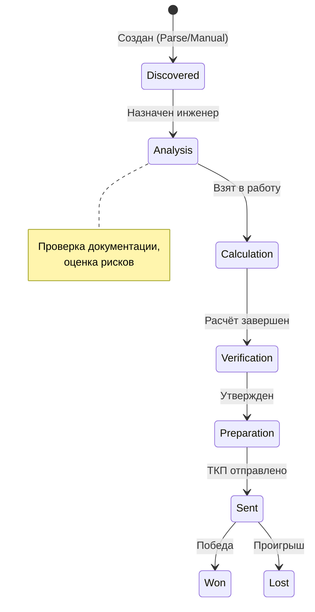
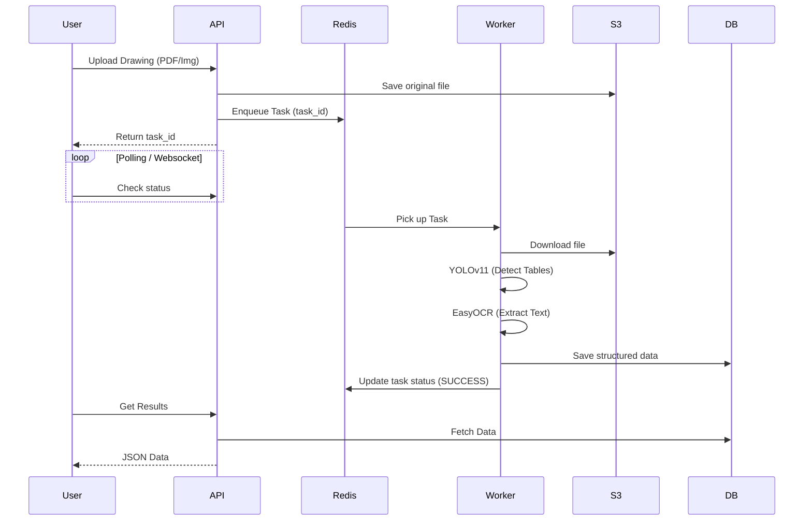

# Архитектура системы

> **🤖 Для AI-разработчика**: Этот документ — твой **главный источник истины**.
>
> 1. **Структура**: Это модульный монолит. Код разделен на логические модули (`modules/`), но запускается в одном процессе FastAPI.
> 2. **Зависимости**: Модули должны быть максимально изолированы. Используй `services` для межмодульного взаимодействия. Не импортируй модели одного модуля напрямую в другой, если это возможно.
> 3. **Асинхронность**: Весь I/O (БД, сеть, файлы) **обязан** быть асинхронным (`async/await`).
> 4. **Проверка**: Перед ответом пользователю всегда проверяй типы (`mypy`) и запускай тесты (`pytest`).

## 📋 Обзор стека (Quick Reference)

| Компонент        | Технология          | Версия         | Примечание                                  |
| ---------------- | ------------------- | -------------- | ------------------------------------------- |
| **Architecture** | Modular Monolith    | -              | Один процесс, логическое разделение         |
| **Backend**      | Python + FastAPI    | 3.11+ / 0.110+ | Строгая типизация (Pydantic v2)             |
| **Frontend**     | React + TS + Vite   | 18 / 5.3+      | TanStack Query, shadcn/ui                   |
| **Database**     | PostgreSQL          | 16             | `asyncpg`, `pgvector` (0.7+)                |
| **ORM**          | SQLAlchemy          | 2.0+           | `AsyncSession`, Declarative Base            |
| **Cache/Queue**  | Redis               | 7              | Кеш сессий, брокер Celery                   |
| **Async Tasks**  | Celery              | 5              | OCR, генерация PDF, Email                   |
| **Storage**      | MinIO               | S3             | Локальный S3-compatible                     |
| **AI Core**      | Claude 3.5 + OpenAI | -              | LLM + Embeddings (`text-embedding-3-large`) |

---

## 🏗️ Архитектурная диаграмма (C4 Level 2)



---

## 📁 Структура проекта

```text
/var/www/seny/
├── backend/
│   ├── app/
│   │   ├── main.py              # Entry point (FastAPI app)
│   │   ├── core/                # Shared kernel (Config, Security, Exceptions)
│   │   ├── db/                  # Database session & migrations
│   │   └── modules/             # 📦 DOMAIN MODULES
│   │       ├── tender_management/  # Тендеры, воронка, Kanban
│   │       ├── pricing_kb_ai/      # Расчёты, RAG, База знаний
│   │       └── docflow/            # Шаблоны, Генерация документов
│   ├── celery_app/              # Конфигурация воркеров
│   └── tests/                   # Pytest (unit & integration)
├── frontend/
│   ├── src/
│   │   ├── api/                 # Generated clients (OpenAPI)
│   │   ├── features/            # UI Features (Tenders, Calculations)
│   │   └── components/ui/       # shadcn/ui atoms
├── docker/                      # Docker Compose configs
└── docs/                        # Documentation
```

---

## 🔄 Потоки данных (Data Flows)

### 1. Жизненный цикл тендера (State Machine)



### 2. RAG Search (Поиск похожих расчётов)

Используется для поиска релевантных исторических данных при создании нового расчета.

1. **Input**: Пользовательский запрос или описание позиции.
2. **Embedding**: Запрос превращается в вектор (OpenAPI `text-embedding-3-large`).
3. **Search**: Cosine similarity поиск по `pgvector` в PostgreSQL.
4. **Rerank/Synthesis**: LLM (Claude 3.5) анализирует найденные записи и формирует ответ.

### 3. OCR Pipeline (Асинхронная обработка)



---

## 🔧 Сервисы и Порты

| Service      | Internal Port | External Port | Description       |
| ------------ | ------------- | ------------- | ----------------- |
| **Frontend** | 3000          | 3000          | Vite Dev Server   |
| **Backend**  | 8000          | 8000          | FastAPI (Uvicorn) |
| **Postgres** | 5432          | 5432          | Main DB           |
| **Redis**    | 6379          | 6379          | Cache / Broker    |
| **MinIO**    | 9000          | 9000          | S3 API            |
| **MinIO UI** | 9001          | 9001          | Console           |

---

## 🔐 Безопасность и Доступ

### Аутентификация

- **Standard**: OAuth2 with Password Flow (Bearer Token).
- **Tokens**: JWT (Access: 30 min, Refresh: 7 days).

### Ролевая модель (RBAC)

Реализована через декоратор `@require_roles`.

| Role       | Description     | Key Permissions                   |
| ---------- | --------------- | --------------------------------- |
| `admin`    | Полный доступ   | Всё + управление пользователями   |
| `manager`  | Менеджер продаж | Создание тендеров, отправка ТКП   |
| `engineer` | Инженер         | Расчёты, тех. анализ, работа с КБ |
| `readonly` | Наблюдатель     | Только просмотр (Audit)           |

---

## ✅ Инструкции для AI (Validation Strategy)

Перед тем как считать задачу выполненной, выполни следующие проверки:

1. **Backend Changes**:
   - Если изменил модели (`models/`): `alembic revision --autogenerate` (но проверь файл!).
   - Если изменил API: Убедись, что Pydantic схемы обновлены.
   - Линтинг: Проверь ошибки в открытых файлах.

2. **Frontend Changes**:
   - Если изменил API Backend: Нужно перегенерировать клиенты (команда `npm run generate-api` в папке frontend - _проверь наличие скрипта_).
   - Типизация: Строгий TS, никаких `any`.

3. **Common Pitfalls**:
   - **N+1 Queries**: В циклах не делай запросы к БД. Используй `options(selectinload(...))` в SQLAlchemy.
   - **Sync in Async**: Не используй блокирующие вызовы (`time.sleep`, `requests`) в async функциях.
   - **Environment**: Не хардкодь конфиги, используй `core.config.settings`.

---

## 🔗 Полезные ссылки

- [Tech Stack](./tech_stack.md) — точные версии библиотек.
- [Data Models](./data_models.md) — схема БД.
- [Backend Rules](../../.cursor/rules/02-backend-development.mdc) — детальные правила Python.
- [Frontend Rules](../../.cursor/rules/03-frontend-development.mdc) — детальные правила React.
