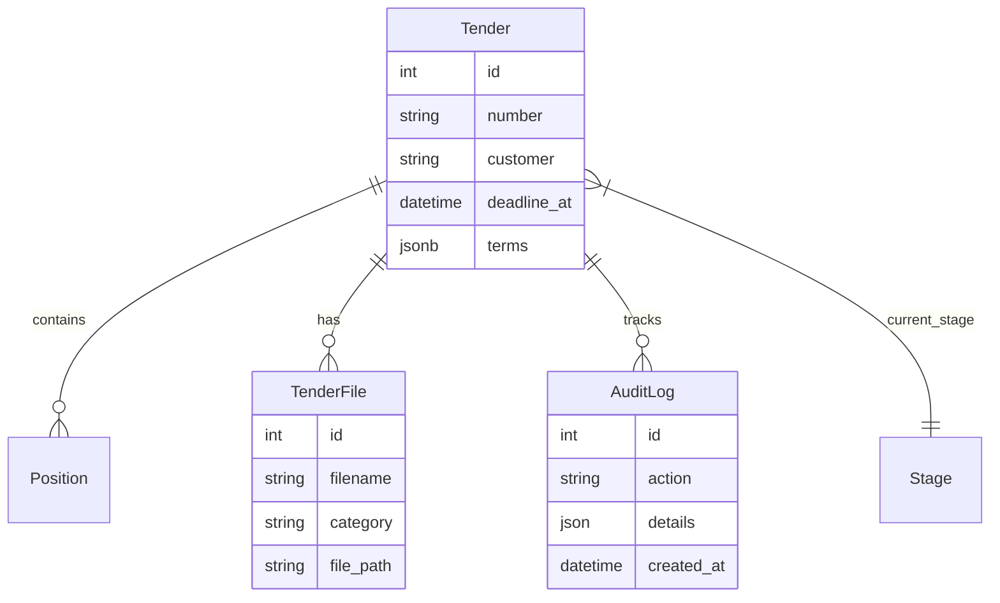

# Описание сущностей системы

## Обзор

Данный документ описывает основные сущности (entities) системы TenderFlow KB AI и их взаимосвязи.

## Основные сущности

### Tender (Тендер)

**Описание**: Основная сущность, представляющая тендерную закупку. Тендер является контейнером, который объединяет позиции, расчёты, статусы и коммуникацию между менеджером и инженером.

**Атрибуты**:

- `id` (int) — уникальный идентификатор
- `number` (str) — номер тендера
- `title` (str) — название тендера
- `customer` (str) — заказчик
- `deadline_at` (datetime) — дедлайн подачи предложения
- `published_at` (datetime) — дата публикации
- `initial_max_price` (Decimal) — НМЦК
- `stage_id` (int) — текущая стадия жизненного цикла
- `responsible_id` (int) — ID ответственного пользователя (менеджер)
- `engineer_id` (int) — ID инженера-расчётчика
- `source` (str) — источник тендера
- `source_url` (str) — ссылка на источник
- `is_archived` (bool) — архивирован/активен
- `terms` (JSONB) — коммерческие условия (оплата, доставка и т.д.)
- `created_at` (datetime) — дата создания
- `updated_at` (datetime) — дата обновления

**Связи**:

- `positions` (1:N) — позиции тендера
- `stage` (M:1) — текущий этап
- `files` (1:N) — загруженные документы
- `audit_logs` (1:N) — история изменений

---

### TenderFile (Файл тендера)

**Описание**: Метаданные файла, загруженного в рамках тендера. Физически файл хранится в S3 (MinIO).

**Атрибуты**:

- `id` (int) — уникальный идентификатор
- `tender_id` (int) — связь с тендером
- `filename` (str) — оригинальное имя файла
- `file_path` (str) — путь в MinIO (`{tender_id}/{uuid}.ext`)
- `category` (str) — категория (ТЗ, КП, Договор, Прочее)
- `uploaded_by_id` (int) — кто загрузил
- `uploaded_at` (datetime) — когда загрузил

**Связи**:

- Принадлежит тендеру (Tender)

---

### AuditLog (Журнал аудита)

**Описание**: Запись о событии или действии пользователя в контексте тендера.

**Атрибуты**:

- `id` (int) — уникальный идентификатор
- `tender_id` (int) — связь с тендером
- `user_id` (int) — кто совершил действие
- `action` (str) — тип действия (`stage_changed`, `file_uploaded`, `tender_created`)
- `details` (JSON) — детали (старое/новое значение, имя файла и т.д.)
- `created_at` (datetime) — время события

**Связи**:

- Принадлежит тендеру (Tender)

---

### Position (Позиция)

**Описание**: Элемент тендерного задания.

**Атрибуты**:

- `id` (int) — уникальный идентификатор
- `tender_id` (int) — связь с тендером
- `name` (str) — название из ТЗ
- `description` (str) — описание
- `quantity` (Decimal) — количество
- `unit` (str) — ед. измерения
- `nomenclature_id` (int) — связь с эталонной номенклатурой
- `status` (str) — статус позиции
- `price_per_unit` (Decimal) — цена за единицу
- `currency` (str) — валюта
- `created_at` (datetime) — дата создания
- `updated_at` (datetime) — дата обновления

**Связи**:

- Принадлежит тендеру (Tender)
- Может ссылаться на номенклатуру (Nomenclature)

---

## Диаграмма связей (Упрощенная)

## Ссылки

- [Архитектура системы](../architecture/system_architecture.md)
- [Аудит состояния](../audit_2024_11_27.md)
