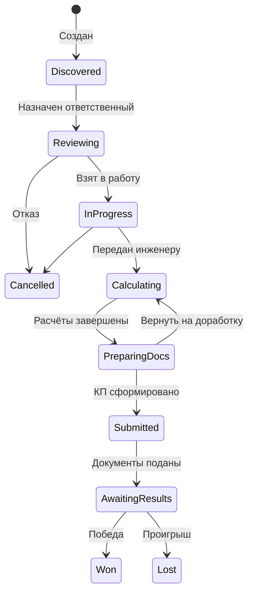

# Модуль Tender Management

> **🤖 Для AI-разработчика**: Это спецификация ядра системы.
>
> 1. **State Machine**: Вся логика переходов стадий тендера находится в `StageService`. Прямое изменение `stage_id` запрещено.
> 2. **Audit**: Любое изменение тендера или позиций должно вызывать запись в `AuditLog` (используй `AuditService`).
> 3. **Files**: Файлы хранятся в MinIO, в БД только метаданные (`TenderFile`).
> 4. **Notifications**: Используй `NotificationService` для уведомлений, не пиши напрямую в БД.

## 📋 Quick Reference

| Параметр       | Значение                                                                 |
| -------------- | ------------------------------------------------------------------------ |
| **Path**       | `backend/app/modules/tender_management/`                                 |
| **API Prefix** | `/api/v1/tenders`, `/api/v1/stages`, `/api/v1/positions`                 |
| **DB Tables**  | `tenders`, `stages`, `positions`, `tasks`, `audit_logs`, `notifications` |
| **Service**    | `TenderService`, `StageService`, `PositionService`                       |
| **Async Jobs** | Уведомления о дедлайнах (Cron), OCR файлов (Celery)                      |

---

## 🖥️ UX-потоки: создание и редактирование

- **`/tenders/new` (frontend)** — отдельная страница с формой.
  - Номер тендера (`number`) подставляется автоматически (префикс `TN-...`), но пользователь может его изменить либо ввести вручную, если номер приходит из внешнего источника.
  - Обязательные поля: `number`, `title`, `customer`, `deadline_at`. Остальное (описание, финансовые параметры, коммерческие условия) опционально.
  - После успешного `POST /api/v1/tenders/` происходит редирект на страницу `/tenders/{id}` и инвалидация списка.
- **`/tenders/:id/edit`** использует ту же форму в режиме редактирования:
  - Значения подтягиваются через `GET /api/v1/tenders/{id}`.
  - По кнопке «Сохранить изменения» отправляется `PUT /api/v1/tenders/{id}`.
  - В шапке формы и карточки отображается внутренний ID (используемый как «служебный номер записи»).
- **Защита от дубликатов**:
  - `TenderService.create/update` проверяет, что `number` уникален. При конфликте выбрасывается `ValueError`, а API возвращает `400` с понятным сообщением.
  - На фронте выводится алерт «Тендер с таким номером уже существует».

> ⚠️ При интеграции с внешними системами обязательно проверяйте наличие номера до отправки или используйте автогенерацию, чтобы избежать конфликтов.

---

## 📁 Файловая структура

```text
backend/app/modules/tender_management/
├── __init__.py
├── models/
│   ├── __init__.py
│   ├── tender.py           # Tender, TenderFile
│   ├── stage.py            # Stage, StageTransition
│   ├── position.py         # Position
│   ├── task.py             # Task
│   ├── proposal.py         # CommercialProposal
│   ├── audit.py            # AuditLog
│   └── notification.py     # Notification
├── schemas/
│   ├── __init__.py
│   ├── tender.py           # TenderCreate, TenderUpdate, TenderResponse
│   ├── stage.py            # StageResponse, StageTransitionResponse
│   ├── position.py         # PositionCreate, PositionUpdate, PositionResponse
│   ├── task.py             # TaskCreate, TaskUpdate, TaskResponse
│   ├── proposal.py         # ProposalUpdate, ProposalResponse
│   ├── notification.py     # NotificationResponse
│   └── filters.py          # TenderFilter, PositionFilter
├── services/
│   ├── __init__.py
│   ├── tender_service.py   # CRUD + бизнес-логика тендеров
│   ├── stage_service.py    # Управление стадиями и переходами (!!! Важно)
│   ├── position_service.py # CRUD позиций
│   ├── task_service.py     # CRUD задач
│   ├── proposal_service.py # Генерация КП
│   ├── notification_service.py  # Отправка уведомлений
│   └── audit_service.py    # Логирование действий
├── routers/
│   ├── __init__.py
│   ├── tenders.py          # /api/v1/tenders/*
│   ├── stages.py           # /api/v1/stages/*
│   ├── positions.py        # /api/v1/positions/*
│   ├── tasks.py            # /api/v1/tasks/*
│   ├── kanban.py           # /api/v1/kanban/*
│   ├── notifications.py    # /api/v1/notifications/*
│   └── analytics.py        # /api/v1/analytics/*
├── dependencies.py         # Зависимости FastAPI
└── exceptions.py           # Кастомные исключения (e.g. TransitionError)
```

---

## 📂 Работа с файлами

1. **Загрузка**: `FileService.upload` читает `UploadFile`, генерирует уникальное имя
   (`{tender_id}/{uuid4}.ext`) и отправляет содержимое в MinIO через `storage.upload_file`,
   обёрнутый в `asyncio.to_thread()`. После успешной загрузки создаётся запись `TenderFile`.
2. **Метаданные**: В `tender_files` хранятся `file_path`, `category`, `uploaded_by_id`,
   а также флаги `is_archived` и `archived_at` для soft delete.
3. **Удаление**: `FileService.delete` помечает запись как архивную (`is_archived = True`),
   проставляет `archived_at`, логирует действие через `AuditService` (`file_deleted`)
   и удаляет объект из MinIO. Прямой `DELETE` из БД запрещён.
4. **Получение ссылок**: `FileService.get_url` возвращает presigned URL только
   для неархивных файлов; архивные возвращают `404`.

> **Важно**: Любые операции с файлами выполняются только через сервисы. Напрямую обращаться к MinIO или таблицам без аудит-логов запрещено.

---

## 🔧 Enums (Domain Constants)

```python
# backend/app/modules/tender_management/enums.py

from enum import Enum

class StageCode(str, Enum):
    """Коды стадий тендера (фиксированные значения)"""
    DISCOVERED = "discovered"           # Обнаружен
    REVIEWING = "reviewing"             # На рассмотрении
    IN_PROGRESS = "in_progress"         # В работе
    CALCULATING = "calculating"         # Расчёт стоимости
    PREPARING_DOCS = "preparing_docs"   # Подготовка документов
    SUBMITTED = "submitted"             # Подача
    AWAITING_RESULTS = "awaiting_results"  # Ожидание результатов
    WON = "won"                         # Выигран
    LOST = "lost"                       # Проигран
    CANCELLED = "cancelled"             # Отменён

class PositionStatus(str, Enum):
    """Статусы позиции"""
    NEW = "new"                                 # Новая
    NOMENCLATURE_ASSIGNED = "nomenclature_assigned"  # Назначена номенклатура
    CALCULATING = "calculating"                 # В расчёте
    CALCULATED = "calculated"                   # Рассчитано
    VERIFIED = "verified"                       # Проверено инженером
    TRANSFERRED = "transferred"                 # Передано менеджеру
    IN_PROPOSAL = "in_proposal"                 # В КП

class CalculationStatus(str, Enum):
    """Статусы расчёта позиции"""
    NOT_ASSIGNED = "not_assigned"
    IN_PROGRESS = "in_progress"
    COMPLETED = "completed"
    CLARIFICATION_NEEDED = "clarification_needed"

class TaskType(str, Enum):
    """Типы задач"""
    TECHNICAL = "technical"           # Технические
    DOCUMENTARY = "documentary"       # Документальные
    ADMINISTRATIVE = "administrative" # Административные
    OTHER = "other"

class TaskStatus(str, Enum):
    """Статусы задач"""
    PENDING = "pending"
    IN_PROGRESS = "in_progress"
    COMPLETED = "completed"
    CANCELLED = "cancelled"

class TaskPriority(str, Enum):
    """Приоритеты задач"""
    LOW = "low"
    MEDIUM = "medium"
    HIGH = "high"
    CRITICAL = "critical"

class FileCategory(str, Enum):
    """Категории файлов тендера"""
    SPECIFICATION = "specification"     # ТЗ
    COMMERCIAL = "commercial"           # Коммерческие требования
    CORRESPONDENCE = "correspondence"   # Переписка
    CLARIFICATION = "clarification"     # Разъяснения
    OTHER = "other"

class NotificationType(str, Enum):
    """Типы уведомлений"""
    DEADLINE_7_DAYS = "deadline_7_days"
    DEADLINE_3_DAYS = "deadline_3_days"
    DEADLINE_1_DAY = "deadline_1_day"
    DEADLINE_HOURS = "deadline_hours"
    ASSIGNED_RESPONSIBLE = "assigned_responsible"
    ASSIGNED_ENGINEER = "assigned_engineer"
    STAGE_CHANGED = "stage_changed"
    NEW_TASK = "new_task"
    TASK_OVERDUE = "task_overdue"
    TENDER_WON = "tender_won"
    TENDER_LOST = "tender_lost"

class AuditAction(str, Enum):
    """Действия для аудит-лога"""
    CREATED = "created"
    UPDATED = "updated"
    STAGE_CHANGED = "stage_changed"
    RESPONSIBLE_ASSIGNED = "responsible_assigned"
    ENGINEER_ASSIGNED = "engineer_assigned"
    POSITION_ADDED = "position_added"
    POSITION_UPDATED = "position_updated"
    POSITION_DELETED = "position_deleted"
    FILE_UPLOADED = "file_uploaded"
    FILE_DELETED = "file_deleted"
    TASK_CREATED = "task_created"
    TASK_COMPLETED = "task_completed"
    CALCULATION_CREATED = "calculation_created"
    PROPOSAL_GENERATED = "proposal_generated"

class TenderSource(str, Enum):
    """Источники тендеров"""
    EIS = "eis"                 # ЕИС (zakupki.gov.ru)
    SBERBANK_AST = "sberbank_ast"
    ROSELTORG = "roseltorg"
    MANUAL = "manual"           # Ручной ввод
```

---

## 🔄 Бизнес-логика: State Machine

Граф переходов стадий тендера. Реализован в `StageService.change_stage`.



### Валидация перехода (Pseudo-code)

```python
async def validate_transition(tender, target_stage, user):
    # 1. Проверка наличия пути в графе
    if not can_transition(tender.stage, target_stage):
        raise TransitionError("Переход невозможен")

    # 2. Проверка прав (RBAC)
    if target_stage.required_role and user.role != target_stage.required_role:
        raise PermissionError("Недостаточно прав")

    # 3. Проверка условий (Conditions)
    if target_stage.requires_all_positions_calculated:
        if not all_positions_calculated(tender):
            raise ConditionError("Есть нерасчитанные позиции")

    if target_stage.requires_commercial_proposal:
        if not tender.has_proposal:
            raise ConditionError("Нет сформированного КП")
```

---

## ✅ Критерии приёмки (Checklist)

### Tender CRUD

- [ ] Создание тендера с валидацией Pydantic (особенно `deadline` > now).
- [ ] Автоматическое присвоение стадии `discovered`.
- [ ] Уникальность `number` (проверка в БД и обработка IntegrityError).
- [ ] `Archive` (soft delete) вместо удаления.
- [ ] Запись в `AuditLog` при создании/изменении.

### Стадии (Stage Service)

- [ ] Реализация метода `change_stage` с проверками.
- [ ] Проверка условий: `responsible_id` установлен, `engineer_id` установлен.
- [ ] Авто-создание задач при переходе (если настроено в `StageTransition`).
- [ ] Отправка уведомлений при смене стадии.

### Позиции

- [ ] CRUD позиций (связь с `Tender`).
- [ ] Расчет `tender_total_price` при изменении кол-ва или цены за единицу.
- [ ] Возможность привязать `Nomenclature` (из модуля Pricing KB).

### Уведомления (Notifications)

- [ ] Фоновая задача (Celery beat) для проверки дедлайнов (7 дней, 3 дня, 24 часа).
- [ ] Уведомление при назначении пользователя на тендер/задачу.
- [ ] API для получения непрочитанных уведомлений.

---

## 🚫 Anti-Patterns (Запрещено)

1. **Sync DB Calls**: `db.query(...)` — запрещено. Только `await db.execute(select(...))`.
2. **N+1 Problems**: Обращение к `tender.positions` без предварительной загрузки (`options(selectinload(...))`).
3. **Hardcoded IDs**: Не использовать `stage_id=1`. Использовать `StageCode.DISCOVERED` и поиск ID по коду.
4. **Direct Stage Change**: `tender.stage_id = new_id; await db.commit()` — **СТРОГО ЗАПРЕЩЕНО**. Только через сервис.

---

## 📎 Связанные документы

- [Data Models](../architecture/data_models.md) — полная схема БД.
- [API Docs](../development/api_docs.md) — контракты API.
- [Pricing KB AI](./pricing_kb_ai.md) — модуль расчетов.
